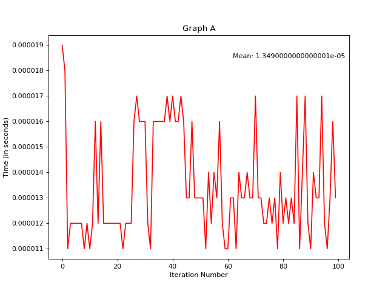
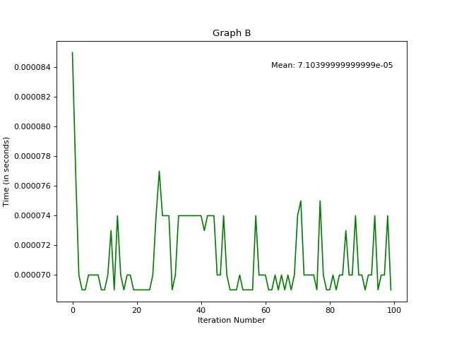
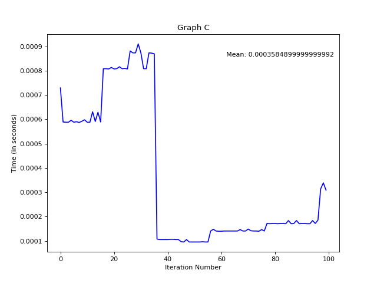
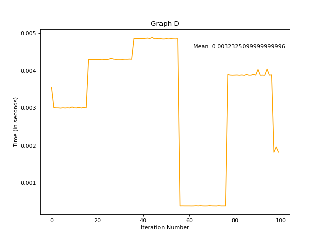
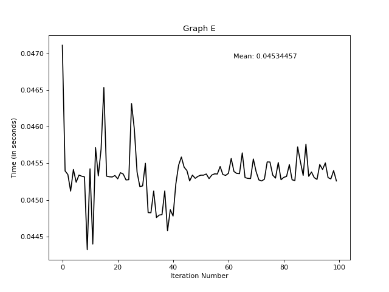
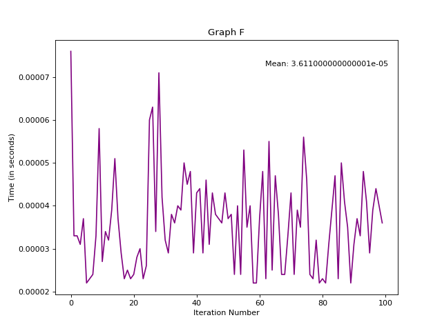

# ++Malloc (CS214 // Assignment 1)
#### Contributors: Seth Karten & Yash Shah 

## Design
Our heap consists of a minimalist metadata structure which makes use of the heap as an array. Along with user data, we use two structures to keep track of data usage within the heap - (1) the superblock, and (2) the data nodes. Both forms of metadata give us insight on the amount and location of available space within our heap. 

The heap array holds our superblock followed by any *n* number of data nodes which are dynamically created based on space requests from the user. 

### Superblock

The superblock consists of the first four bytes of our heap structure. Within these four bytes we allocated 2 bytes for the initialization flag, and the remaining 2 bytes to hold the amount of bytes available in the heap.

For our initialization flag, we use the first two bytes to store our initialization character using the ASCII character `Y`. We use two bytes to store our intitialization flag to reduce the probability of a false positive read for the initialization value. 

Given that ASCII stores values between 0-255, we deduced the probability of the initialization character `Y` existing at any given byte before initialization to be around `0.4%`. 

However, to decrease the odds of a false positive read, we used simple probability and found that using two bytes of data holding the same ASCII character significantly decreases the chance of a false positive read of our initialization flag: 

The remaining two bytes of the superblock structure are used for storing the number of bytes of available space in the heap array. This space reflects the sum of the reserved space in all of the *unused* data nodes of our heap array. 

We store this value in just two bytes using a rudimentary base64 implementation. The storage of these values is further discussed in the section titled "Base64 Conversion" under "Implementation".

### Data Node

Following the superblock, out first data node exists at `index=3` of the heap array. Each data node comprises of three parts: (1) the `IN_USE` flag, (2) the size of the reserved data space, and (3) the data space itself.

The diagram above reflects a sample data node reserving four bytes of space for the user. 

We use one byte for the `IN_USE` flag, which is represented by one of two ASCII characters - `Y` and `N`. 

The next two bytes represent the space reserved with this node in our rudimentary version of base64. We use this value to traverse through our data nodes in our heap array, and with this value, we know exactly where the next data node starts. 

The following set of bytes are considered user space and a pointer to the byte at the beginning of this set is handed back on a successful call to `mymalloc`. 

## Implementation 

### `mymalloc`

Our implementation of malloc begins by checking if the heap was initialized, and if not, we set up the heap array with one data node of size `4088` bytes - the maximum space that can be alloted due to space taken up by metadata. 

When allocating space, we simply traverse through all of our nodes and using the first-fit method of placement, allocate the first block of unused space which matches the user's request and return a pointer to the first byte of the data space. If the existing node is much larger than the requested space, we split the data node into two, where the first node has the requested space as it's size, and the second with the remaining space available. 

### `myfree`

When freeing space, we replace the data space with NULL characters after identifying the block space, and mark the flag as `NOT_IN_USE`. However, as a check for a valid pointer, we ensure that the pointer passed to us includes the `IN_USE` flag three bytes before the address given.

We noticed one potential error in this representation which could occur during our `free` method, where if we receive a pointer to the middle of the data space, and the byte two indices before the given pointer represents the ASCII character `Y`, our program can be fooled into thinking that it was a valid pointer. However, in our attempt to minimize the metadata structure as much as possible, we found that our initially derived probability of the byte representing our `IN_USE` flag is negligible enough at `0.4%`. 

### `base64` conversion

In order to reduce the size of the metadata, we decided that integers hold an expensive data size, while giving us very little benefit as the largest value we need to store for any given data node is `4088`. We discovered that using just two bytes, we can store any value between `0` and `4095` using a very rudimentary form of base64. 

We chose base64 because since we had just two bytes to store our data, we found that the square root of `4096` (the size of our heap) is, in fact, `64`. As a result, we wrote two functions to encode and decode any integer value given a point of reference to the heap. 

We accomplished this by storing numerical values as `char` in both bytes, where we can decode the value of the first byte by multiplying it by `64`, and adding it to the value of the following byte.

The following diagram provides a visual representation of how we would store the number `65` in two bytes.

### `clean`

In an effort to reduce fragmentation caused by small blocks of unused space we created this function to clear up some space. If the current available space is less than the user requested space, this function gets called once to attempt to find these unused blocks and combine them.

Any two contiguous blocks of unused space can be combined into one in order to make more available space, as each combination will free up the three bytes used by the metadata along with creating data nodes that are larger.

## Testing and Instrumentation

We implemented each of the six test cases required by the assignment, and ran each test 100 times. We used time as a measurement of performance, and charted the time it took for each iteration of the test cases and plotted them out on a graph to understand how our implemenation performed on each iteration. 

### Test A:

This test comprised of us allocating one byte and immediately freeing it for 150 times. 

We found that this test succeeded every time, and our implementation handled the workload efficiently enough. Due to the short runtime of this process, the spikes are fairly insignificant as it can easily be correlated to variations in the CPU cycles. However, you can notice that the very first iteration takes the longest as it needs to create a brand new data node to split up the reserved space into a block of one byte, and another block of the remaining bytes.

### Test B:

This test comprised of us allocating 150 one-byte spaces. We were asked to free the allocations everytime we completed 50 requests.

We found that this test succeeded every time, and our implementation was able to create 50 different data nodes consisting of one byte of reserved space for each of them. Upon freeing them, it wouldn't reset the heap structure, and each subsequent request of fifty one-byte blocks were handled quickly using the first-fit placement method. 

### Test C:

This test extended the previous test case by randomly allocating and freeing one-byte blocks of space until we had successfully allocated fifty blocks of space. From this point, we are to free all fifty allocated blocks. 

We found that this test case presented an additional level of stress to our malloc implementation with its varied allocation and freeing. As a result, you'll find that the runtime for this test case is an entire order of magnitude higher than the previous ones. This makes sense as some test cases must have requested frequent freeing of allocated space.

### Test D:

This test comprises of randomly calling our implementation of malloc and free until we have 50 active blocks of data. The additional variability introduced by this test case is that the amount of requested space can vary from `1`-`64` bytes.

We found that our implementation handled this test case gracefully and was able to successfully allocated up to fifty blocks of varied sizes. Notice that this additional variation caused us to use consistently create new blocks as well as defragment the heap structure, and as a result, each iteration of this test case had a runtime measured in milliseconds.

### Test E:

This test comprises of allocating as many blocks as possible of a block size of 1 byte to a block size 4088 bytes. For example, we consistently allocate blocks of 1 byte until our heap structure does not have any available space. From this point, it will free all requested blocks of data and repeat the process for 2 byte blocks, and so on.

We found that this added a unique stress load to our algorithm as each subsequent iteration requried our implementation to clean the blocks and start over. You'll notice that the time has less variations towards the end of our iterations and we believe that this dampening occurs due to 

### Test F:

This test comprises of triggering errors in our malloc and free implementations by performing the following operations:
- Calling `free` on addresses that are not pointers
- Calling `free` on pointers not assigned by `mymalloc`
- Calling `free` on pointers after they have already been freed
- Calling `malloc` on invalid sizes
- Calling `free` on a `NULL` pointer

